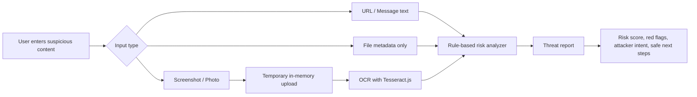

# CyberThreatDetector

> A polished cyber safety scanner for suspicious URLs, scam messages, risky file names, and screenshot-based threats.

[](https://react.dev/)
[](https://vitejs.dev/)
[](https://expressjs.com/)
[](https://tesseract.projectnaptha.com/)

CyberThreatDetector helps beginners understand suspicious digital content before they click, reply, download, or share sensitive information. It generates a clear threat report with a risk score, red flags, threat type, attacker intent, and safe next steps.

Built for the **Codex Creator Challenge**.

---

## Quick Navigation

- [Live Product Feel](#live-product-feel)
- [Features](#features)
- [How It Works](#how-it-works)
- [Tech Stack](#tech-stack)
- [Run Locally](#run-locally)
- [API Routes](#api-routes)
- [Safety Model](#safety-model)
- [Testing](#testing)
- [Project Structure](#project-structure)
- [What Is Real vs Demo](#what-is-real-vs-demo)
- [Roadmap](#roadmap)

---

## Live Product Feel

CyberThreatDetector is designed to feel like a clean cyber game-style security product:

- Dark navy / black-blue interface
- Neon green and cyber blue accents
- Glowing scanner cards
- Tabbed analyzer panel
- Demo threat report preview
- Real threat story cards
- Beginner-friendly threat explanations

> No fake live attack map. No fake malware scanning. No scareware. Just clear risk indicators and safer next steps.

---

## Features

| Feature | What it does |
|---|---|
| Suspicious URL Analysis | Checks links for shortened domains, impersonation, suspicious words, raw IPs, long URLs, and deceptive domain patterns. |
| Email & Message Scam Detection | Detects urgency, sensitive info requests, payment scams, too-good-to-be-true claims, attachments, and dangerous instructions. |
| Screenshot Scam Checker | Upload a JPG, PNG, or WEBP screenshot/photo. OCR extracts visible text and sends it into the same risk analyzer. |
| File Name Risk Checker | Checks file metadata only, including suspicious extensions, double extensions, archive files, macro-enabled files, and lure words. |
| Emergency Context | If a user already clicked, entered a password, sent money, installed software, or gave remote access, the report escalates to Critical. |
| Clear Threat Report | Returns risk level, score, summary, red flags, safe actions, extracted links, file warnings, and disclaimer. |

---

## How It Works



The analyzer uses rule-based scoring. It does **not** claim anything is 100% safe.

---

## Tech Stack

**Frontend**

- React
- Vite
- Plain CSS

**Backend**

- Node.js
- Express
- Multer for safe in-memory image upload
- Tesseract.js for OCR

---

## Run Locally

<details open>
<summary><strong>1. Install dependencies</strong></summary>

```powershell
npm --prefix backend install
npm --prefix frontend install
```

Or from the root:

```powershell
npm run install:all
```

</details>

<details open>
<summary><strong>2. Start the backend</strong></summary>

```powershell
npm --prefix backend run dev
```

Backend runs on:

```text
http://127.0.0.1:5000
```

</details>

<details open>
<summary><strong>3. Start the frontend</strong></summary>

```powershell
npm --prefix frontend run dev
```

Frontend runs on:

```text
http://127.0.0.1:5173
```

</details>

---

## API Routes

### `GET /api/health`

Simple health check.

```json
{
  "ok": true,
  "service": "cyber-risk-checker"
}
```

### `POST /api/analyze-risk`

Analyzes pasted text, URLs, sender/source context, file metadata, and user actions.

<details>
<summary>Example request</summary>

```json
{
  "message": "URGENT: Your PayPal account is suspended. Click https://paypal-verify-account.com and verify your password now.",
  "senderEmail": "security-alert@gmail.com",
  "source": "",
  "file": {
    "fileName": "invoice.pdf.exe",
    "fileSizeBytes": 245760,
    "userAlreadyDownloaded": false,
    "userAlreadyOpened": false
  },
  "userActions": {
    "clickedLink": false,
    "enteredPassword": false,
    "sharedCode": false,
    "sentMoney": false,
    "installedSoftware": false,
    "gaveRemoteAccess": false
  }
}
```

</details>

<details>
<summary>Example response</summary>

```json
{
  "riskLevel": "Critical Risk",
  "score": 100,
  "summary": "Treat this as urgent. The message, link, file metadata, or actions already taken indicate a serious risk that needs immediate protective steps.",
  "redFlags": [
    "Urgency or fear language: urgent",
    "Requests sensitive information: password",
    "Possible paypal impersonation: paypal-verify-account.com is not paypal.com"
  ],
  "safeActions": [
    "Stop interacting with the message/file immediately.",
    "If you entered a password, change it from the official website or app.",
    "If you shared a verification code, secure that account immediately."
  ],
  "extractedLinks": ["https://paypal-verify-account.com"],
  "fileWarnings": [],
  "disclaimer": "This tool provides risk indicators, not a guarantee. Verify sensitive actions through official websites or apps."
}
```

</details>

### `POST /api/analyze-screenshot`

Accepts a screenshot/photo upload, extracts text with OCR, and analyzes the extracted text.

**Allowed image types only:**

- JPG / JPEG
- PNG
- WEBP

**Maximum size:** 5MB

**Storage:** memory only, never permanently saved.

---

## Safety Model

CyberThreatDetector follows a conservative safety design:

- Does not ask users to upload executable files
- Does not execute uploaded content
- Does not store uploaded screenshots
- Does not scan malware
- Does not claim a result is guaranteed safe
- Uses screenshot OCR only for JPG, PNG, and WEBP files
- Uses file metadata only for file checks

Every report includes:

> This tool provides risk indicators, not a guarantee. Verify sensitive actions through official websites or apps.

---

## Testing

Run backend analyzer tests:

```powershell
npm --prefix backend test
```

Build frontend:

```powershell
npm --prefix frontend run build
```

Manual test ideas:

- Paste a PayPal phishing message
- Paste a normal meeting note
- Check `invoice.pdf.exe`
- Upload a screenshot containing suspicious text
- Try uploading a PDF or EXE to screenshot upload and confirm it is rejected
- Check “I entered my password” and confirm Critical risk actions appear

---

## Project Structure

```text
CyberThreatDetector/
├── backend/
│   ├── server.js
│   ├── riskAnalyzer.js
│   ├── riskAnalyzer.test.js
│   ├── screenshotAnalyzer.js
│   ├── screenshotAnalyzer.test.js
│   ├── package.json
│   └── package-lock.json
├── frontend/
│   ├── src/
│   │   ├── App.jsx
│   │   ├── App.css
│   │   ├── components.jsx
│   │   ├── content.js
│   │   └── main.jsx
│   ├── index.html
│   ├── vite.config.js
│   ├── package.json
│   └── package-lock.json
├── .gitignore
├── package.json
└── README.md
```

---

## What Is Real vs Demo

**Real functionality**

- URL/message analysis via `/api/analyze-risk`
- File metadata analysis via `/api/analyze-risk`
- Screenshot OCR via `/api/analyze-screenshot`
- Rule-based scoring engine
- Critical escalation when risky user actions already happened

**Demo/sample presentation**

- The homepage preview card is labeled as sample output
- Threat type and attacker intent on the frontend are explanatory labels derived from analyzer results
- No live threat intelligence feed is used
- No malware sandboxing or antivirus scanning is performed

---

## Roadmap

- Add saved scan history with user consent
- Add exportable PDF threat reports
- Add richer threat categories
- Add domain reputation API integration
- Add official reporting links by threat type
- Add accessibility polish and keyboard scan shortcuts

---

## Disclaimer

CyberThreatDetector is an educational tool. Always verify important security decisions through official websites, official apps, known phone numbers, or trusted security professionals.
